# My_SIEM — Lightweight ELK + Snort SIEM (Debian 13)

A fully containerized, classroom-grade SIEM that you can run on a Debian 13 VM. It wires Snort network detection to Elasticsearch via Filebeat, with Kibana for visualization. Includes a small vulnerable web app to easily generate test traffic and validate rules.


## Table of Contents
- **[Overview](#overview)**
- **[Architecture](#architecture)**
- **[Services](#services)**
- **[Quick Start (Debian 13 tested)](#quick-start-debian-13-tested)**
- **[Kibana Setup (first run)](#kibana-setup-first-run)**
- **[Snort Rules — Playbook with Repro Commands](#snort-rules--playbook-with-repro-commands)**
- **[How Logs Flow](#how-logs-flow)**
- **[Operations](#operations)**
- **[Troubleshooting](#troubleshooting)**
- **[Customize / Extend](#customize--extend)**
- **[Credits](#credits)**


## Overview
This project ships a minimal SIEM:
- **Network IDS**: Snort (logs to `alert_fast.txt`).
- **Shipper**: Filebeat (tails Snort alerts and sends to Elasticsearch).
- **Storage**: Elasticsearch (single-node, xpack security disabled).
- **UI**: Kibana.
- **Syslog collector (optional today)**: syslog-ng (listens on 514/udp, 601/tcp to file; not shipped to ES by default).
- **Test app**: Simple PHP app on `http://VM_IP:8080` to trigger HTTP rules.

Everything is orchestrated with Docker Compose.


## Architecture
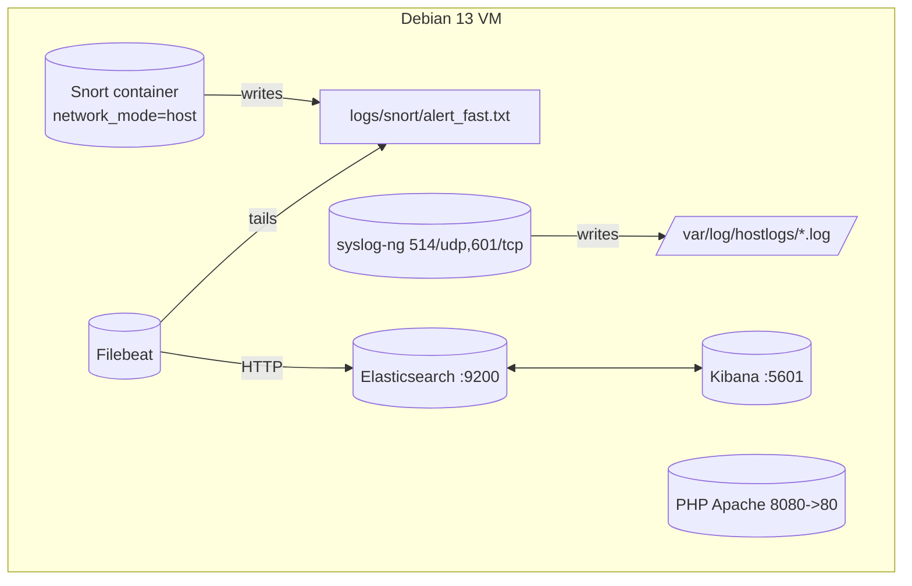

Key links:
- Snort writes to `./logs/snort/` (host). Filebeat reads that same path and ships to Elasticsearch.
- Kibana connects to Elasticsearch and you explore indices `filebeat-*`.
- syslog-ng currently writes local files only (for future expansion).


## Services
Defined in `docker-compose.yml`:

- **elasticsearch** (`docker.elastic.co/elasticsearch/elasticsearch:8.9.0`)
  - Ports: `9200:9200`
  - Heap: `ES_JAVA_OPTS=-Xms1g -Xmx1g`
  - Data volume: `esdata` -> `/usr/share/elasticsearch/data`

- **kibana** (`docker.elastic.co/kibana/kibana:8.9.0`)
  - Ports: `5601:5601`
  - Env: `ELASTICSEARCH_HOSTS=http://elasticsearch:9200`

- **snort** (`frapsoft/snort`)
  - Runs in `network_mode: host` to sniff all interfaces
  - Config: `./configs/snort/snort.conf` includes `./configs/snort/rules/local.rules`
  - Output: `alert_fast: /var/log/snort/alert_fast.txt`
  - Volume: `./logs/snort:/var/log/snort`

- **filebeat** (`docker.elastic.co/beats/filebeat:8.9.0`)
  - Config: `./configs/filebeat.yml`
  - Reads: `/var/log/snort/alert_fast.txt`
  - Sends to: `http://elasticsearch:9200`

- **syslog-ng** (`linuxserver/syslog-ng`)
  - Ports: `514/udp`, `601/tcp`
  - Config: `./configs/syslog-ng.conf`
  - Writes host logs under `/var/log/hostlogs/$HOST_FROM.log` (inside the container)
  - Note: Not yet shipped to Elasticsearch by default in this project.

- **web** (`php:8.1-apache`)
  - Ports: `8080:80`
  - Serves `./configs/web/index.php`
  - For generating benign + suspicious HTTP traffic (demo only)


## Quick Start (Debian 13 tested)
Followed and validated on a fresh Debian 13 VM.

0. **Become root**
   ```bash
   su
   ```
   Keep this root session open until the end of installation process.

1. **Install Git**
   ```bash
   apt update && apt install -y git
   ```
2. **Clone the repo**
   ```bash
   git clone https://github.com/fireblock29/My_SIEM
   cd My_SIEM
   ```
3. **Run the installer** (installs Docker Engine + Compose plugin, adds your user to the `docker` group, sets filebeat perms)
   ```bash
   chmod +x ./install.sh
   ./install.sh
   ```
4. **Reboot** to apply the `docker` group membership
   If you are using a CLI, here is the command to reboot:
   ```bash
   /usr/sbin/reboot
   ```
5. **Start the stack** (after reboot, cd back to the project)
   ```bash
   cd ~/My_SIEM
   docker compose up -d
   ```
6. **Wait** until Docker pulls are done and containers are healthy. First run can take a while. Then wait another ~60s for services to settle.

7. **Open Kibana** from your workstation browser (on the same network):
   - URL: `http://VM_IP:5601`

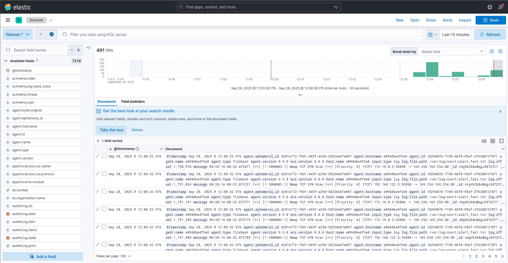


## Kibana Setup (first run)
1. Click "Explore on my own".
2. Open the burger menu (top-left) → "Discover".
3. Click "Create data view".
4. Name: anything (e.g., `Snort Alerts`)
5. Index pattern: `filebeat-*`
6. Save.

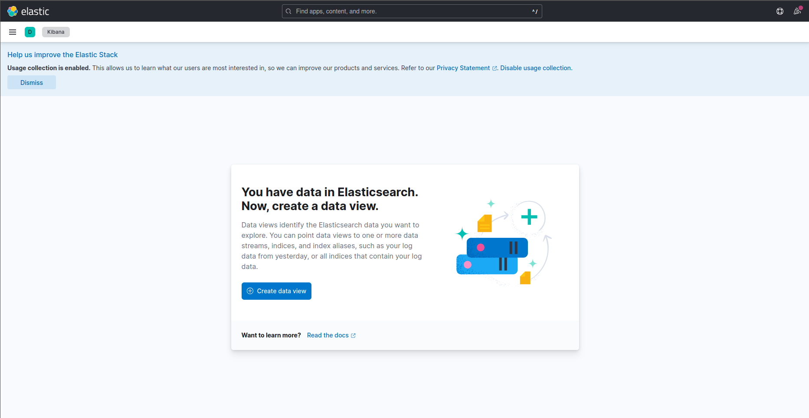
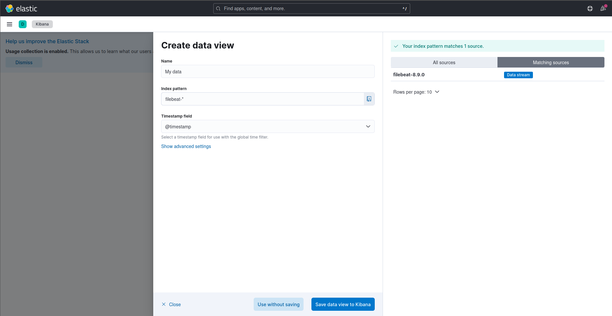

Tip: You will mainly search in the `message` field (raw Snort alert line), e.g. `message: "Nmap TCP SYN Scan"`.


## Snort Rules — Playbook with Repro Commands
Active rules are in `configs/snort/rules/local.rules`. The following 5 rules are enabled.

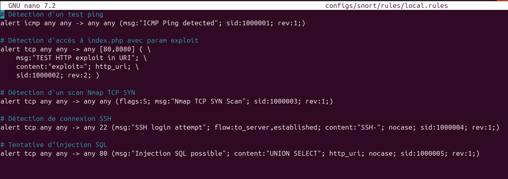

### 1) ICMP Ping detected — SID 1000001
Rule:
```snort
alert icmp any any -> any any (msg:"ICMP Ping detected"; sid:1000001; rev:1;)
```
- **Explanation**: Triggers on any ICMP packet (e.g., ping/echo) observed on the host.
- **How it’s detected**: Packet type ICMP. No other conditions.
- **Reproduce (from another machine on same network)**:
  ```bash
  ping -c 1 VM_IPV4           # IPv4
  # or
  ping -6 -c 1 VM_IPV6        # IPv6
  ```
- **Snort alert example** (from `logs/snort/alert_fast.txt`):
  ```text
  09/12-17:25:31.426992  [**] [1:1000001:1] ICMP Ping detected [**] [Priority: 0] {IPV6-ICMP} fe80::585b:c1ff:fef7:5e22 -> ff02::16
  ```
- **Kibana**: Search `message: "ICMP Ping detected"`.
- **Screenshot placeholder**: 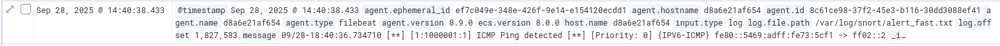

---

### 2) TEST HTTP exploit in URI — SID 1000002
Rule:
```snort
alert tcp any any -> any [80,8080] (
    msg:"TEST HTTP exploit in URI";
    content:"exploit="; http_uri;
    sid:1009001; rev:2; )
```
- **Explanation**: Flags HTTP requests that contain the parameter `exploit=` in the URI.
- **How it’s detected**: Looks for `exploit=` in the HTTP URI on ports 80 or 8080.
- **Test app**: `http://VM_IP:8080/index.php` (see `configs/web/index.php`).
- **Reproduce**:
  ```bash
  curl -i "http://VM_IP:8080/index.php?exploit=test"
  ```
- **Snort alert example**:
  ```text
  09/13-16:48:15.952432  [**] [1:1009001:2] TEST HTTP exploit in URI [**] [Priority: 0] {TCP} 192.168.122.1:53250 -> 192.168.122.95:8080
  ```
- **Kibana**: Search `message: "TEST HTTP exploit in URI"`.
- **Screenshot placeholder**: 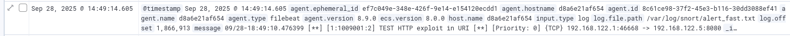

---

### 3) Nmap TCP SYN Scan — SID 1000003
Rule:
```snort
alert tcp any any -> any any (flags:S; msg:"Nmap TCP SYN Scan"; sid:1000003; rev:1;)
```
- **Explanation**: Triggers on TCP packets with SYN flag (typical of SYN scans).
- **How it’s detected**: Looks for SYN-only packets hitting any destination port.
- **Reproduce** (from another machine):
  ```bash
  nmap -sS VM_IP
  ```
- **Snort alert example**:
  ```text
  09/13-16:57:42.554678  [**] [1:1000003:1] Nmap TCP SYN Scan [**] [Priority: 0] {TCP} 192.168.122.1:56910 -> 172.18.0.2:80
  ```
- **Kibana**: Search `message: "Nmap TCP SYN Scan"`.
- **Screenshot placeholder**: 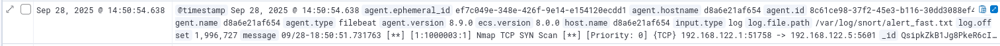

---

### 4) SSH login attempt — SID 1000004
Rule:
```snort
alert tcp any any -> any 22 (msg:"SSH login attempt"; flow:to_server,established; content:"SSH-"; nocase; sid:1009004; rev:1;)
```
- **Explanation**: Triggers when an SSH banner exchange is detected on port 22.
- **How it’s detected**: TCP to port 22 with `SSH-` sequence in an established flow.
- **Reproduce** (from another machine):
  ```bash
  ssh YOUR_USER@VM_IP
  ```
- **Snort alert example**:
  ```text
  09/13-16:53:07.114324  [**] [1:1009004:1] SSH login attempt [**] [Priority: 0] {TCP} 192.168.122.1:56706 -> 192.168.122.95:22
  ```
- **Kibana**: Search `message: "SSH login attempt"`.
- **Screenshot placeholder**: 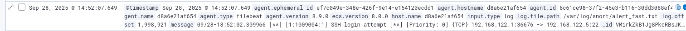

---

### 5) Injection SQL possible — SID 1000005
Rule:
```snort
alert tcp any any -> any 80 (msg:"Injection SQL possible"; content:"UNION SELECT"; http_uri; nocase; sid:1000008; rev:1;)
```
- **Explanation**: Flags HTTP requests whose URI includes `UNION SELECT` (classic SQLi pattern).
- **How it’s detected**: Looks for `UNION SELECT` in the HTTP URI to port 80.
- **Note**: Even if you hit `http://VM_IP:8080/...`, Docker NAT sends traffic to container port 80; Snort (on host) typically also sees the bridged `-> 172.x.x.x:80` flow.
- **Reproduce**:
  ```bash
  curl -i "http://VM_IP:8080/index.php?q=UNION%20SELECT%201,2"
  ```
- **Snort alert example**:
  ```text
  09/13-17:16:25.117832  [**] [1:1000008:1] Injection SQL possible [**] [Priority: 0] {TCP} 192.168.122.1:60690 -> 192.168.122.95:80
  ```
- **Kibana**: Search `message: "Injection SQL possible"`.
- **Screenshot placeholder**: 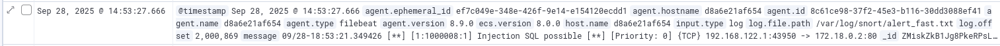


## How Logs Flow
- Snort config: `configs/snort/snort.conf`
  - Key outputs:
    ```
    output alert_fast: /var/log/snort/alert_fast.txt
    output unified2: filename snort.log, limit 128
    ```
  - Includes `include /etc/snort/rules/local.rules`.

- Filebeat config: `configs/filebeat.yml`
  - Inputs:
    ```yaml
    filebeat.inputs:
      - type: log
        enabled: true
        paths:
          - /var/log/snort/alert_fast.txt
        scan_frequency: 10s
        tail_files: true
    ```
  - Output:
    ```yaml
    output.elasticsearch:
      hosts: ["http://elasticsearch:9200"]
    setup.kibana:
      host: "http://kibana:5601"
    ```
  - Notes: We ship raw lines; query on the `message` field in Kibana.
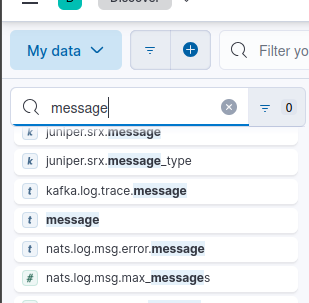
By specifying the "message" field, we can have a more digestible view of the alerts in Kibana. It is possible to add more fields to the data view.

- syslog-ng (optional today): `configs/syslog-ng.conf`
  - Listens on 514/udp and 601/tcp, writes to `/var/log/hostlogs/$HOST_FROM.log` (container FS).
  - Currently not ingested by Filebeat; see [Customize / Extend](#customize--extend).


## Operations
- **Check status**
  ```bash
  docker ps
  docker compose ps
  docker compose logs -f filebeat
  docker compose logs -f snort
  ```

- **Tail Snort alerts directly**
  ```bash
  tail -f logs/snort/alert_fast.txt
  ```

- **Start / Stop**
  ```bash
  docker compose up -d
  docker compose down
  ```

- **Full reset (wipes Elasticsearch data!)**
  ```bash
  docker compose down -v   # removes volumes including esdata
  rm -rf logs/snort/*      # optional: clear Snort logs
  ```

- **Update rules**
  - Edit `configs/snort/rules/local.rules`.
  - Restart Snort:
    ```bash
    docker compose restart snort
    ```


## Troubleshooting
- **Elasticsearch not starting / red or unhealthy**
  - Give the VM more RAM/CPU. ES heap is set to 1GB; 4GB+ system RAM is recommended for the VM.

- **Permission error on Filebeat config**
  - The installer sets `chmod go-w ./configs/filebeat.yml` because Filebeat refuses group-writable configs.

- **Kibana not reachable**
  - Check `docker compose logs kibana` and `elasticsearch`.
  - Ensure your desktop and VM are on the same network; open `http://VM_IP:5601` from the desktop.

- **No alerts in Kibana**
  - Generate traffic using the playbook above (ping, curl, ssh, nmap).
  - Tail `logs/snort/alert_fast.txt` to confirm Snort is firing.
  - Check Filebeat logs for shipping errors: `docker compose logs -f filebeat`.

- **Security note**
  - Elasticsearch security is disabled for simplicity; do not expose ports 9200/5601 to the internet.


## Customize / Extend
- **Add more Snort rules**: Put them into `configs/snort/rules/local.rules`.
- **Dashboards**: Build Kibana visualizations on top of `filebeat-*` (e.g., top signatures, sources, destinations).


## Credits
- **Authors**:
  - Axel GROGNET
  - Lucas PERROT
  - Tim QUEFFURUS
- **University / Class / Teacher**: Université du Québec à Chicoutimi / Sécurité Informatique / Fehmi JAAFAR
- **Install script**: `install.sh` installs Docker Engine + Compose plugin, enables Docker, adds user to `docker` group, fixes Filebeat config permissions.


## Appendix — File/Path Reference
- `docker-compose.yml`
- `configs/snort/snort.conf`
- `configs/snort/rules/local.rules`
- `configs/filebeat.yml`
- `configs/syslog-ng.conf`
- `configs/web/index.php`
- `logs/snort/alert_fast.txt`
