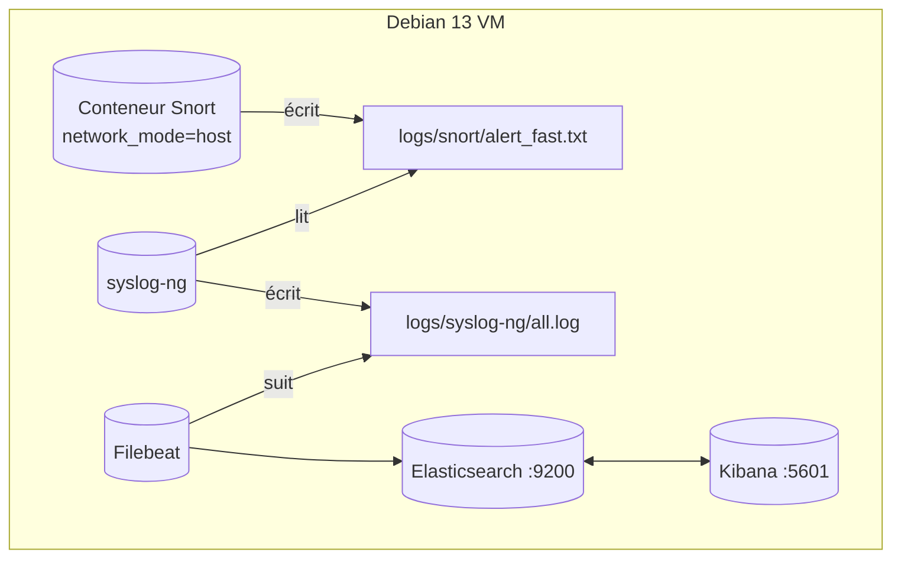
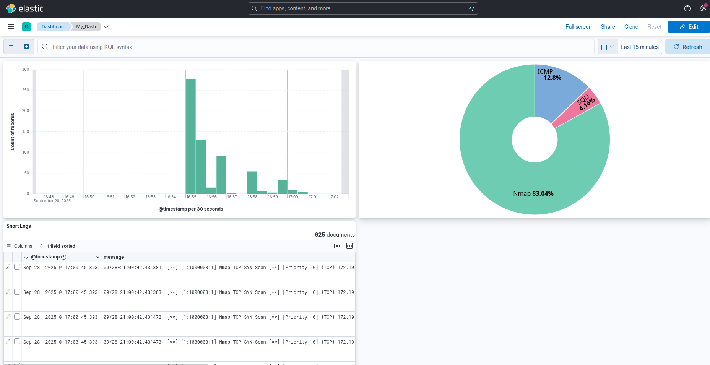

# My_SIEM — SIEM ELK + Snort léger (Debian 13)

Un SIEM entièrement conteneurisé que vous pouvez exécuter sur une VM Debian 13. Il relie la détection réseau de Snort à Elasticsearch via Filebeat, avec Kibana pour la visualisation. Il inclut une petite application web vulnérable pour générer facilement du trafic de test et valider les règles.

## Table des matières
- **[Aperçu](#aperçu)**
- **[Architecture](#architecture)**
- **[Services](#services)**
- **[Démarrage rapide (testé sur Debian 13)](#démarrage-rapide-testé-sur-debian-13)**
- **[Configuration de Kibana (premier lancement)](#configuration-de-kibana-premier-lancement)**
- **[Règles Snort — Tests et commandes de repro](#règles-snort--carnet-de-tests-avec-commandes-de-repro)**
- **[Flux des journaux](#flux-des-journaux)**
- **[Opérations](#opérations)**
- **[Dépannage](#dépannage)**
- **[Personnaliser / Étendre](#personnaliser--étendre)**
- **[Crédits](#crédits)**

## Aperçu
Ce projet fournit un SIEM minimal :
- **IDS réseau** : Snort (journalise dans `alert_fast.txt`).
- **Collecteur Syslog** : syslog-ng (écoute et écrit dans le fichier `all.log`).
- **Collecteur/shipper** : Filebeat (écoute les logs et les envoie à Elasticsearch).
- **Stockage** : Elasticsearch.
- **Interface** : Kibana.
- **Appli de test** : Petite appli PHP sur `http://VM_IP:8080` pour déclencher des règles HTTP.

Le tout est orchestré avec Docker Compose.

## Architecture

Note : ce schéma est rendu par Mermaid. Vous pouvez le visualiser correctement sur [le dépôt GitHub du projet](https://github.com/fireblock29/My_SIEM).

Liens clés :
- Snort écrit dans `./logs/snort/alert_fast.txt` (hôte). Syslog-ng lit ce même chemin et écrit dans `logs/syslog-ng/all.log`.
- Filebeat suit `logs/syslog-ng/all.log` et envoie les logs à Elasticsearch.
- Kibana se connecte à Elasticsearch et vous explorez les index `filebeat-*`.

## Services
Définis dans `docker-compose.yml` :

- **elasticsearch** (`docker.elastic.co/elasticsearch/elasticsearch:8.9.0`)
  - Ports : `9200:9200`
  - Heap : `ES_JAVA_OPTS=-Xms1g -Xmx1g`
  - Volume de données : `esdata` -> `/usr/share/elasticsearch/data`

- **kibana** (`docker.elastic.co/kibana/kibana:8.9.0`)
  - Ports : `5601:5601`
  - Env : `ELASTICSEARCH_HOSTS=http://elasticsearch:9200`

- **snort** (`frapsoft/snort`)
  - S’exécute avec `network_mode: host` pour sniffer toutes les interfaces
  - Config : `./configs/snort/snort.conf` inclut `./configs/snort/rules/local.rules`
  - Sortie : `alert_fast: /var/log/snort/alert_fast.txt`
  - Volume : `./logs/snort:/var/log/snort`

- **syslog-ng** (`balabit/syslog-ng:latest`)
  - Config : `./configs/syslog-ng.conf`
  - Écrit les logs hôtes sous `/var/log/syslog-ng/all.log` (dans le conteneur)

- **filebeat** (`docker.elastic.co/beats/filebeat:8.9.0`)
  - Config : `./configs/filebeat.yml`
  - Lit : `/var/log/snort/alert_fast.txt`
  - Envoie vers : `http://elasticsearch:9200`

- **web** (`php:8.1-apache`)
  - Ports : `8080:80`
  - Sert `./configs/web/index.php`
  - Pour générer du trafic HTTP bénin + suspect (démo uniquement)

## Démarrage rapide (testé sur Debian 13)
Procédure suivie et validée sur une VM Debian 13 neuve.
Pour un tutoriel d'installation d'une VM Debian 13, voir le fichier [Installation_VM.md](Installation_VM.md).   

0. **Passer root**
   ```bash
   su
   ```
   Gardez cette session root ouverte jusqu’à l’étape **4. Reboot**.

1. **Installer Git**
   ```bash
   apt update && apt install -y git
   ```
2. **Cloner le dépôt**
   ```bash
   git clone https://github.com/fireblock29/My_SIEM
   cd My_SIEM
   ```
3. **Lancer l’installateur** (installe Docker Engine + plugin Compose, ajoute votre utilisateur au groupe `docker`, corrige les permissions de filebeat)
   ```bash
   chmod +x ./install.sh
   ./install.sh
   ```
4. **Redémarrer** pour appliquer l’appartenance au groupe `docker`
   Si vous utilisez une CLI, voici la commande pour redémarrer :
   ```bash
   /usr/sbin/reboot
   ```
5. **Démarrer la stack** (après redémarrage, revenez dans le projet)
   ```bash
   cd ~/My_SIEM
   docker compose up -d
   ```
6. **Attendre** que les images soient tirées et les conteneurs en bonne santé. Le premier lancement peut être long. Attendre ensuite ~60s le temps que les services se stabilisent.

7. **Ouvrir Kibana** depuis votre poste (sur le même réseau) :
   - URL : `http://VM_IP:5601`


## Configuration de Kibana (premier lancement)
1. Cliquer sur « Explore on my own ».
2. Ouvrir le menu (en haut à gauche) → « Discover ».
3. Cliquer sur « Create data view ».
4. Nom : au choix (ex. `Snort Alerts`)
5. Modèle d’index : `filebeat-*`
6. Enregistrer.


Astuce : Vous chercherez principalement dans le champ `message` (ligne d’alerte Snort brute), par ex. `message: "Nmap TCP SYN Scan"`.

## Configuration du tableau de bord Kibana
1. Ouvrir le menu (en haut à gauche) → « Stack Management ».
2. Cliquer sur « Saved Objects ».
3. Cliquer sur « Import ».
4. Sélectionner le fichier `dashboard.ndjson` du projet.
5. Cliquer sur « Import ».
6. Ouvrir le menu (en haut à gauche) → « Dashboard ».
7. Cliquer sur « My_Dash ».

Bien sûr, vous pouvez créer votre propre dashboard et l’enregistrer. Ici, on fournit le modèle « My_Dash » pour démarrer.



## Règles Snort — Carnet de tests avec commandes de repro
Les règles actives sont dans `configs/snort/rules/local.rules`. Les 5 règles suivantes sont activées.

- ICMP Ping detected
- TEST HTTP exploit in URI
- Nmap TCP SYN Scan
- SSH login attempt
- Injection SQL possible


### Objectif et principes de conception
Les cinq règles activées dans `configs/snort/rules/local.rules` ont été sélectionnées pour trois objectifs complémentaires :

1. **Représentativité** — chaque règle correspond à une classe d’événements de sécurité courants en environnement réel : reconnaissance réseau (ICMP, Nmap), sondes/exploits au niveau web/app (URI suspects, injection SQL) et tentatives d’accès/authentification (SSH).  
2. **Simplicité opérationnelle** — des règles claires, basées signature, facilitent la validation du pipeline d’ingestion/alerte du SIEM (génération → normalisation → corrélation → triage).  
3. **Extensibilité** — ces signatures servent de base qui peut être ajustée, contextualisée, ou remplacée par des détections comportementales à mesure que l’environnement mûrit.

Ces règles sont représentatives plutôt qu’exhaustives. Elles apportent une valeur immédiate pour les démos, les tests d’intégration et comme point de départ pour des améliorations itératives (réglage des seuils, ajout de contexte, réduction des faux positifs).

---

### Justification règle par règle

#### ICMP Ping detected  
**Pourquoi :** Les requêtes ICMP echo sont un moyen de découverte réseau utilisé en reconnaissance.  
**Valeur :** Faible complexité et bon signal pour les activités de reconnaissance en phase initiale ; utile pour valider le pipeline de bout en bout et élever l’attention sur le scanning.  
**Limites & réglages :** En environnements gérés, l’ICMP peut être bruyant (outils de monitoring, découverte légitime). À mitiger via des listes blanches, des seuils de débit ou en exigeant plusieurs hôtes distincts avant d’alerter.

#### TEST HTTP exploit in URI  
**Pourquoi :** Les URI malveillants contiennent parfois des tentatives d’exploit pour sonder des endpoints applicatifs via le chemin de requête.  
**Valeur :** Détecte les scanners automatisés et les charges naïves ; aide à démontrer la corrélation entre alertes réseau et logs applicatifs.  
**Limites & réglages :** Les charges évoluent vite et peuvent être obfusquées. Utiliser cette règle comme signal précoce et la compléter par l’analyse des logs applicatifs.

#### Nmap TCP SYN Scan  
**Pourquoi :** Les SYN scans sont un moyen courant de découverte de ports et largement utilisés en reconnaissance.  
**Valeur :** Indicateur fiable d’un scan actif ; précède souvent une activité plus ciblée et aide à prioriser les incidents.  
**Limites & réglages :** Des outils légitimes d’inventaire/monitoring peuvent déclencher cette signature. Ajouter des filtres contextuels (scanners connus, fenêtres de maintenance) ou corréler avec les informations à disposition pour réduire les faux positifs.

#### SSH login attempt  
**Pourquoi :** SSH est fréquemment ciblé (brute force, credential stuffing, opportunisme).  
**Valeur :** Détecter les tentatives d’authentification permet une détection précoce des accès non autorisés et supporte des réponses immédiates (blocage, alerte SOC).  
**Limites & réglages :** Une tentative unique est bruyante ; évaluer en agrégeant par IP source, en comptant les échecs sur une fenêtre, ou en corrélant avec la géolocalisation/listes IP malveillantes.

#### Possible SQL injection  
**Pourquoi :** L’injection SQL reste une menace critique au niveau applicatif ; beaucoup d’attaques apparaissent comme des motifs SQL suspects dans les paramètres/payloads HTTP.  
**Valeur :** Identifie des tentatives probables d’injection et permet une investigation rapide (examiner logs applicatifs, accès base).  
**Limites & réglages :** Les correspondances simples génèrent des faux positifs (requêtes complexes, contenu encodé, usages légitimes de caractères spéciaux). À combiner avec d'autres événements, des listes de paramètres autorisés et du contexte aval (requêtes DB inhabituelles, création de nouveaux comptes).

### Arbitrages et raisons globales
- **Simplicité vs couverture :** Ces règles privilégient des signatures claires et explicables, faciles à valider et déboguer. Elles n’essaient pas de couvrir toutes les obfuscations avancées ou modèles C2 sophistiqués. C’est délibéré : une base simple et bien comprise est essentielle pour valider les pipelines d’un mini-SIEM comme le nôtre.  
- **Chaîne de détection :** Ensemble, les règles couvrent une progression typique d’attaque : découverte (ICMP, Nmap) → probe/exploit (URI HTTP, motifs SQL) → tentatives d’accès (SSH). Cela facilite la démonstration de la corrélation, de l’enrichissement et des playbooks d’escalade.  
- **Extensibilité :** Une fois la ligne de base établie, passer à des capacités avancées : détection comportementale (anomalies), corrélation temporelle (ex. scan suivi d’un exploit ciblé), mesures sur l'endpoint/app pour réduire les faux positifs et détecter les attaques furtives.

---

### 1) ICMP Ping detected — SID 1000001
Règle :
```snort
alert icmp any any -> any any (msg:"ICMP Ping detected"; sid:1000001; rev:1;)
```
- **Explication** : Déclenche sur tout paquet ICMP (ex. ping/echo) observé sur l’hôte.
- **Comment c’est détecté** : Type de paquet ICMP. Pas d’autre condition.
- **Reproduire (depuis une autre machine du même réseau)** :
  ```bash
  ping -c 5 VM_IPV4           # IPv4
  # ou
  ping -6 -c 5 VM_IPV6        # IPv6
  ```
- **Exemple d’alerte Snort** :
  ```text
  09/12-17:25:31.426992  [**] [1:1000001:1] ICMP Ping detected [**] [Priority: 0] {IPV6-ICMP} 192.168.122.1 -> 192.168.122.95
  ```
- **Comment le lire** : 192.168.122.1 est l’IP source (attaquant), 192.168.122.95 l’IP destination (cible)
- **Kibana** : Rechercher `message: "ICMP Ping detected"`.
- **Capture d’écran** : 

---

### 2) TEST HTTP exploit in URI — SID 1000002
Règle :
```snort
alert tcp any any -> any [80,8080] (
    msg:"TEST HTTP exploit in URI";
    content:"exploit="; http_uri;
    sid:1009001; rev:2; )
```
- **Explication** : Signale les requêtes HTTP qui contiennent le paramètre `exploit=` dans l’URI.
- **Comment c’est détecté** : Recherche `exploit=` dans l’URI HTTP sur les ports 80 ou 8080.
- **Appli de test** : `http://VM_IP:8080/index.php` (voir `configs/web/index.php`).
- **Reproduire** :
  ```bash
  curl -i "http://VM_IP:8080/index.php?exploit=test"
  ```
- **Exemple d’alerte Snort** :
  ```text
  09/13-16:48:15.952432  [**] [1:1000002:2] TEST HTTP exploit in URI [**] [Priority: 0] {TCP} 192.168.122.1:53250 -> 192.168.122.95:8080
  ```
- **Comment le lire** : 192.168.122.1 est l’IP source (attaquant), 192.168.122.95 l’IP destination (cible)
- **Kibana** : Rechercher `message: "TEST HTTP exploit in URI"`.
- **Capture d’écran** : 

---

### 3) Nmap TCP SYN Scan — SID 1000003
Règle :
```snort
alert tcp any any -> any any (flags:S; msg:"Nmap TCP SYN Scan"; sid:1000003; rev:1;)
```
- **Explication** : Déclenche sur des paquets TCP avec le flag SYN (typique des SYN scans).
- **Comment c’est détecté** : Recherche des paquets SYN seuls vers n’importe quel port destination.
- **Reproduire** (depuis une autre machine) :
  ```bash
  nmap -sS VM_IP
  ```
- **Exemple d’alerte Snort** :
  ```text
  09/13-16:57:42.554678  [**] [1:1000003:1] Nmap TCP SYN Scan [**] [Priority: 0] {TCP} 192.168.122.1:56910 -> 192.168.122.95:80
  ```
- **Comment le lire** : 192.168.122.1 est l’IP source (attaquant), 192.168.122.95 l’IP destination (cible)
- **Kibana** : Rechercher `message: "Nmap TCP SYN Scan"`.
- **Capture d’écran** : 

---

### 4) SSH login attempt — SID 1000004
Règle :
```snort
alert tcp any any -> any 22 (msg:"SSH login attempt"; flow:to_server,established; content:"SSH-"; nocase; sid:1009004; rev:1;)
```
- **Explication** : Déclenche quand un échange de bannière SSH est détecté sur le port 22.
- **Comment c’est détecté** : TCP vers le port 22 avec la séquence `SSH-` dans un flux établi.
- **Reproduire** (depuis une autre machine) :
  ```bash
  ssh YOUR_USER@VM_IP
  ```
- **Exemple d’alerte Snort** :
  ```text
  09/13-16:53:07.114324  [**] [1:1000004:1] SSH login attempt [**] [Priority: 0] {TCP} 192.168.122.1:56706 -> 192.168.122.95:22
  ```
- **Comment le lire** : 192.168.122.1 est l’IP source (attaquant), 192.168.122.95 l’IP destination (cible)
- **Kibana** : Rechercher `message: "SSH login attempt"`.
- **Capture d’écran** : 

---

### 5) Injection SQL possible — SID 1000005
Règle :
```snort
alert tcp any any -> any 80 (msg:"Injection SQL possible"; content:"UNION SELECT"; http_uri; nocase; sid:1000008; rev:1;)
```
- **Explication** : Signale les requêtes HTTP dont l’URI contient `UNION SELECT` (motif SQLi classique).
- **Comment c’est détecté** : Recherche `UNION SELECT` dans l’URI HTTP vers le port 80.
- **Note** : Même si vous tapez `http://VM_IP:8080/...`, la NAT Docker envoie vers le port 80 du conteneur ; Snort (sur l’hôte) voit typiquement aussi le flux ponté `-> 172.x.x.x:80`.
- **Reproduire** :
  ```bash
  curl -i "http://VM_IP:8080/index.php?q=UNION%20SELECT%201,2"
  ```
- **Exemple d’alerte Snort** :
  ```text
  09/13-17:16:25.117832  [**] [1:1000005:1] Injection SQL possible [**] [Priority: 0] {TCP} 192.168.122.1:60690 -> 192.168.122.95:80
  ```
- **Comment le lire** : 192.168.122.1 est l’IP source (attaquant), 192.168.122.95 l’IP destination (cible)
- **Kibana** : Rechercher `message: "Injection SQL possible"`.
- **Capture d’écran** : 

## Flux des journaux
- Config Snort : `configs/snort/snort.conf`
  - Sorties clés :
    ```
    output alert_fast: /var/log/snort/alert_fast.txt
    output unified2: filename snort.log, limit 128
    ```
  - Inclut `include /etc/snort/rules/local.rules`.

- syslog-ng : `configs/syslog-ng.conf`
  - Écoute et écrit dans `/var/log/syslog-ng/all.log`.

- Config Filebeat : `configs/filebeat.yml`
  - Entrées :
    ```yaml
    filebeat.inputs:
      - type: log
        enabled: true
        paths:
          - /var/log/syslog-ng/all.log
        scan_frequency: 10s
        tail_files: true
    ```
  - Sortie :
    ```yaml
    output.elasticsearch:
      hosts: ["http://elasticsearch:9200"]
    setup.kibana:
      host: "http://kibana:5601"
    ```
  - Notes : On expédie des lignes brutes ; interrogez le champ `message` dans Kibana.
  En spécifiant le champ "message", on obtient une vue plus digeste des alertes dans Kibana. Il est possible d’ajouter plus de champs à la data view.
  
  


## Opérations
- **Vérifier l’état**
  ```bash
  docker ps
  docker compose ps
  docker compose logs -f filebeat
  docker compose logs -f snort
  ```

- **Suivre les alertes Snort directement**
  ```bash
  tail -f logs/snort/alert_fast.txt
  ```

- **Démarrer / Arrêter**
  ```bash
  docker compose up -d
  docker compose down
  ```

- **Remise à zéro complète (efface les données Elasticsearch !)**
  ```bash
  docker compose down -v   # supprime les volumes dont esdata
  rm -rf logs/snort/*      # optionnel : vider les logs Snort
  ```

- **Mettre à jour les règles**
  - Éditer `configs/snort/rules/local.rules`.
  - Redémarrer Snort :
    ```bash
    docker compose restart snort
    ```

## Dépannage
- **Elasticsearch ne démarre pas / rouge ou instable**
  - Allouer plus de RAM/CPU à la VM. Le heap ES est à 1 Go ; 4 Go+ de RAM système sont recommandés pour la VM.

- **Erreur de permission sur la config Filebeat**
  - L’installateur exécute `chmod go-w ./configs/filebeat.yml` car Filebeat refuse les configs accessibles en écriture par le groupe.

- **Kibana inaccessible**
  - Vérifier `docker compose logs kibana` et `elasticsearch`.
  - Assurez-vous que votre poste et la VM sont sur le même réseau ; ouvrir `http://VM_IP:5601` depuis le poste.

- **Pas d’alertes dans Kibana**
  - Générer du trafic via le carnet ci-dessus (ping, curl, ssh, nmap).
  - Suivre `logs/snort/alert_fast.txt` pour confirmer que Snort déclenche.
  - Vérifier les logs Filebeat pour des erreurs d’expédition : `docker compose logs -f filebeat`.

- **Les derniers logs n’apparaissent pas dans Kibana**
  - Dans Kibana, réglez la plage temporelle (en haut à droite) pour que le champ « To » soit sur Now (utilisez une plage relative comme « Last 15 minutes »). Si « To » est un horodatage figé dans le passé, les nouveaux événements n’apparaîtront pas. Vous pouvez activer l’auto-rafraîchissement (ex. toutes les 10s).

## Personnaliser / Étendre
- **Ajouter des règles Snort** : Placez-les dans `configs/snort/rules/local.rules`.
- **Tableaux de bord** : Construisez des visualisations Kibana sur `filebeat-*` (ex. top signatures, sources, destinations).

## Crédits
- **Auteurs** :
  - Axel GROGNET
  - Lucas PERROT
  - Tim QUEFFURUS
- **Université / Cours / Enseignant** : Université du Québec à Chicoutimi / Sécurité Informatique / Fehmi JAAFAR


## Annexe — Références fichiers/chemins
- `docker-compose.yml`
- `configs/snort/snort.conf`
- `configs/snort/rules/local.rules`
- `configs/filebeat.yml`
- `configs/syslog-ng.conf`
- `configs/web/index.php`
- `logs/snort/alert_fast.txt`
- `install.sh` : installe Docker Engine + plugin Compose, active Docker, ajoute l’utilisateur au groupe `docker`, corrige les permissions de la config Filebeat.
