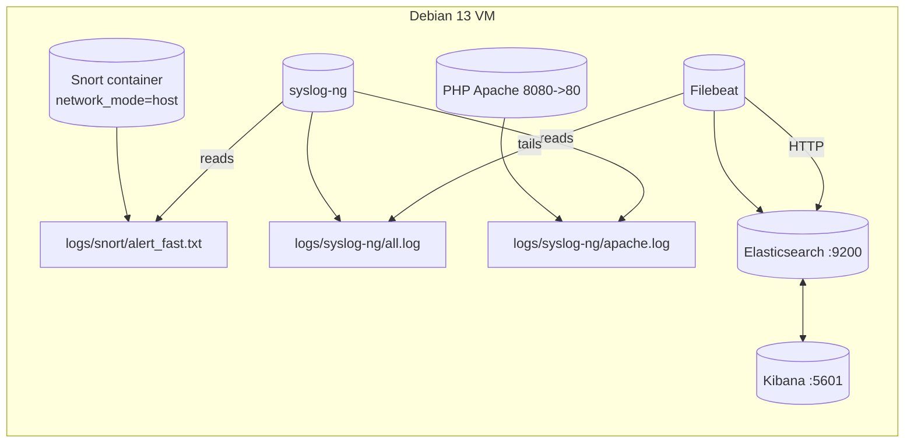

# My_SIEM — Lightweight ELK + Snort SIEM (Debian 13)

A fully containerized, classroom-grade SIEM that you can run on a Debian 13 VM. It wires Snort network detection to Elasticsearch via Filebeat, with Kibana for visualization. Includes a small vulnerable web app to easily generate test traffic and validate rules.


## Table of Contents
- **[Overview](#overview)**
- **[Architecture](#architecture)**
- **[Services](#services)**
- **[Quick Start (Debian 13 tested)](#quick-start-debian-13-tested)**
- **[Kibana Setup (first run)](#kibana-setup-first-run)**
- **[Snort Rules — Playbook with Repro Commands](#snort-rules--playbook-with-repro-commands)**
- **[How Logs Flow](#how-logs-flow)**
- **[Operations](#operations)**
- **[Troubleshooting](#troubleshooting)**
- **[Customize / Extend](#customize--extend)**
- **[Credits](#credits)**


## Overview
This project ships a minimal SIEM:
- **Network IDS**: Snort (logs to `alert_fast.txt`).
- **Shipper**: Filebeat (tails Snort alerts and sends to Elasticsearch).
- **Storage**: Elasticsearch (single-node, xpack security disabled).
- **UI**: Kibana.
- **Syslog collector**: syslog-ng (listens on 514/udp, 601/tcp to file; not shipped to ES by default).
- **Test app**: Simple PHP app on `http://VM_IP:8080` to trigger HTTP rules.

Everything is orchestrated with Docker Compose.


## Architecture

Note: this schema is rendered by Mermaid. You can see it properly on the Github repository of this project.

Key links:
- Snort writes to `./logs/snort/` (host). Filebeat reads that same path and ships to Elasticsearch.
- Kibana connects to Elasticsearch and you explore indices `filebeat-*`.


## Services
Defined in `docker-compose.yml`:

- **elasticsearch** (`docker.elastic.co/elasticsearch/elasticsearch:8.9.0`)
  - Ports: `9200:9200`
  - Heap: `ES_JAVA_OPTS=-Xms1g -Xmx1g`
  - Data volume: `esdata` -> `/usr/share/elasticsearch/data`

- **kibana** (`docker.elastic.co/kibana/kibana:8.9.0`)
  - Ports: `5601:5601`
  - Env: `ELASTICSEARCH_HOSTS=http://elasticsearch:9200`

- **snort** (`frapsoft/snort`)
  - Runs in `network_mode: host` to sniff all interfaces
  - Config: `./configs/snort/snort.conf` includes `./configs/snort/rules/local.rules`
  - Output: `alert_fast: /var/log/snort/alert_fast.txt`
  - Volume: `./logs/snort:/var/log/snort`

- **filebeat** (`docker.elastic.co/beats/filebeat:8.9.0`)
  - Config: `./configs/filebeat.yml`
  - Reads: `/var/log/snort/alert_fast.txt`
  - Sends to: `http://elasticsearch:9200`

- **syslog-ng** (`linuxserver/syslog-ng`)
  - Ports: `514/udp`, `601/tcp`
  - Config: `./configs/syslog-ng.conf`
  - Writes host logs under `/var/log/hostlogs/$HOST_FROM.log` (inside the container)

- **web** (`php:8.1-apache`)
  - Ports: `8080:80`
  - Serves `./configs/web/index.php`
  - For generating benign + suspicious HTTP traffic (demo only)


## Quick Start (Debian 13 tested)
Followed and validated on a fresh Debian 13 VM.

0. **Become root**
   ```bash
   su
   ```
   Keep this root session open until the **4. Reboot** step.

1. **Install Git**
   ```bash
   apt update && apt install -y git
   ```
2. **Clone the repo**
   ```bash
   git clone https://github.com/fireblock29/My_SIEM
   cd My_SIEM
   ```
3. **Run the installer** (installs Docker Engine + Compose plugin, adds your user to the `docker` group, sets filebeat perms)
   ```bash
   chmod +x ./install.sh
   ./install.sh
   ```
4. **Reboot** to apply the `docker` group membership
   If you are using a CLI, here is the command to reboot:
   ```bash
   /usr/sbin/reboot
   ```
5. **Start the stack** (after reboot, cd back to the project)
   ```bash
   cd ~/My_SIEM
   docker compose up -d
   ```
6. **Wait** until Docker pulls are done and containers are healthy. First run can take a while. Then wait another ~60s for services to settle.

7. **Open Kibana** from your workstation browser (on the same network):
   - URL: `http://VM_IP:5601`


## Kibana Setup (first run)
1. Click "Explore on my own".
2. Open the burger menu (top-left) → "Discover".
3. Click "Create data view".
4. Name: anything (e.g., `Snort Alerts`)
5. Index pattern: `filebeat-*`
6. Save.


Tip: You will mainly search in the `message` field (raw Snort alert line), e.g. `message: "Nmap TCP SYN Scan"`.

## Kibana Dashboard Setup
1. Open the burger menu (top-left) → "Stack Management".
2. Click "Saved Objects".
3. Click "Import".
4. Select the `dashboard.ndjson` file from the project.
5. Click "Import".
6. Open the burger menu (top-left) → "Dashboard".
7. Click "My_Dash".

Of course, you can create your own dashboard and save it. But here, we give the model of "My_Dash" to get you started.


## Snort Rules — Playbook with Repro Commands
Active rules are in `configs/snort/rules/local.rules`. The following 5 rules are enabled.

- ICMP Ping detected
- TEST HTTP exploit in URI
- Nmap TCP SYN Scan
- SSH login attempt
- Injection SQL possible


### Purpose and design goals
The five enabled rules in `configs/snort/rules/local.rules` were selected to serve three complementary purposes:

1. **Representativeness** — each rule corresponds to a common class of security-relevant event seen in real environments: network reconnaissance (ICMP, Nmap), web/application-level probes and exploits (suspicious URIs, SQL injection), and authentication/endpoint access attempts (SSH).  
2. **Operational simplicity** — clear, signature-based rules make it easy to validate the SIEM ingestion and alerting pipeline (generation → normalization → correlation → triage).  
3. **Extensibility** — these signatures form a baseline that can be tuned, contextualized, or replaced with behavior-based detections as the environment matures.

These rules are representative rather than exhaustive. They provide immediate value for demonstrations, integration tests, and as a starting point for iterative improvements (tuning thresholds, adding context, reducing false positives).

---

### Rule-by-rule justification

#### ICMP Ping detected  
**Why:** ICMP echo requests are a canonical network discovery method used in reconnaissance.  
**Value:** Low complexity and high signal for early-stage recon activities; useful to validate pipeline end-to-end and to raise early awareness of scanning activity.  
**Limitations & tuning:** In managed environments ICMP can be noisy (monitoring tools, legitimate discovery). Mitigate with whitelists, rate thresholds, or by requiring multiple distinct hosts before promoting an alert.

#### TEST HTTP exploit in URI  
**Why:** Malicious or scanner-generated URIs often carry exploit attempts or test payloads — probing application endpoints via the request path is a frequent attack vector.  
**Value:** Detects automated scanners and naive exploit payloads; helps demonstrate correlation between network alerts and application logs.  
**Limitations & tuning:** Attack payloads evolve quickly and can be obfuscated. Use this rule as an early-warning signal and complement it with application log parsing, WAF logs, or contextual checks (e.g., unexpected user agent, referrer).

#### Nmap TCP SYN Scan  
**Why:** SYN scans are one of the most common methods for port discovery and are widely used in reconnaissance.  
**Value:** High-fidelity indicator of active port scanning; often precedes more targeted activity and is valuable for incident prioritization.  
**Limitations & tuning:** Legitimate inventory or monitoring systems can trigger this signature. Add contextual filters (known scanner hosts, maintenance windows) or correlate with asset-management data to reduce false positives.

#### SSH login attempt  
**Why:** SSH is a frequent target for brute-force, credential-stuffing, or opportunistic compromise attempts.  
**Value:** Detecting authentication attempts enables early detection of unauthorized access attempts and supports immediate response actions (block, alert SOC).  
**Limitations & tuning:** Single login attempts are noisy; evaluate by aggregating by source IP, counting failed attempts in a window, or correlating with geolocation/known-bad IP lists to prioritize true threats.

#### Possible SQL injection  
**Why:** SQL injection remains a critical application-layer threat; many attacks surface as suspicious SQL-like patterns contained in HTTP parameters or payloads.  
**Value:** Identifies likely injection attempts and enables rapid follow-up investigation (review app logs, database access patterns).  
**Limitations & tuning:** Simple pattern matches produce false positives (complex queries, encoded content, legitimate use of special characters). Combine with WAF events, parameter whitelisting, and downstream context (unusual DB queries, new accounts created) to improve precision.


### Overall trade-offs and rationale
- **Simplicity vs. coverage:** These rules prioritize clear, explainable signatures that are easy to validate and debug. They intentionally do not attempt to cover every advanced obfuscation or sophisticated C2 pattern. That trade-off is deliberate: a simple, well-understood baseline is essential for validating a Mini SIEM’s pipelines and for teaching/assessment scenarios.  
- **Detection chain demonstration:** Together the rules span the typical attack progression: discovery (ICMP, Nmap) → probe/exploit (HTTP URI, SQL patterns) → access attempts (SSH). This makes it straightforward to demonstrate correlation logic, alert enrichment, and escalation playbooks.  
- **Extensibility:** Once baseline behavior and alert quality are established, move to more advanced capabilities: behavior-based detection (anomaly detection on baseline traffic), temporal correlation (e.g., scan followed by targeted exploit), reputation feeds, and integration of endpoint/application telemetry to reduce false positives and detect stealthier attacks.

---

### 1) ICMP Ping detected — SID 1000001
Rule:
```snort
alert icmp any any -> any any (msg:"ICMP Ping detected"; sid:1000001; rev:1;)
```
- **Explanation**: Triggers on any ICMP packet (e.g., ping/echo) observed on the host.
- **How it’s detected**: Packet type ICMP. No other conditions.
- **Reproduce (from another machine on same network)**:
  ```bash
  ping -c 5 VM_IPV4           # IPv4
  # or
  ping -6 -c 5 VM_IPV6        # IPv6
  ```
- **Snort alert example** (from `logs/snort/alert_fast.txt`):
  ```text
  09/12-17:25:31.426992  [**] [1:1000001:1] ICMP Ping detected [**] [Priority: 0] {IPV6-ICMP} 192.168.122.1 -> 192.168.122.95
  ```
- **How to read it**: 192.168.122.1 is the source IP (attacker), 192.168.122.95 is the destination IP (target)
- **Kibana**: Search `message: "ICMP Ping detected"`.
- **Screenshot placeholder**: 

---

### 2) TEST HTTP exploit in URI — SID 1000002
Rule:
```snort
alert tcp any any -> any [80,8080] (
    msg:"TEST HTTP exploit in URI";
    content:"exploit="; http_uri;
    sid:1009001; rev:2; )
```
- **Explanation**: Flags HTTP requests that contain the parameter `exploit=` in the URI.
- **How it’s detected**: Looks for `exploit=` in the HTTP URI on ports 80 or 8080.
- **Test app**: `http://VM_IP:8080/index.php` (see `configs/web/index.php`).
- **Reproduce**:
  ```bash
  curl -i "http://VM_IP:8080/index.php?exploit=test"
  ```
- **Snort alert example**:
  ```text
  09/13-16:48:15.952432  [**] [1:1000002:2] TEST HTTP exploit in URI [**] [Priority: 0] {TCP} 192.168.122.1:53250 -> 192.168.122.95:8080
  ```
- **How to read it**: 192.168.122.1 is the source IP (attacker), 192.168.122.95 is the destination IP (target)
- **Kibana**: Search `message: "TEST HTTP exploit in URI"`.
- **Screenshot placeholder**: 

---

### 3) Nmap TCP SYN Scan — SID 1000003
Rule:
```snort
alert tcp any any -> any any (flags:S; msg:"Nmap TCP SYN Scan"; sid:1000003; rev:1;)
```
- **Explanation**: Triggers on TCP packets with SYN flag (typical of SYN scans).
- **How it’s detected**: Looks for SYN-only packets hitting any destination port.
- **Reproduce** (from another machine):
  ```bash
  nmap -sS VM_IP
  ```
- **Snort alert example**:
  ```text
  09/13-16:57:42.554678  [**] [1:1000003:1] Nmap TCP SYN Scan [**] [Priority: 0] {TCP} 192.168.122.1:56910 -> 192.168.122.95:80
  ```
- **How to read it**: 192.168.122.1 is the source IP (attacker), 192.168.122.95 is the destination IP (target)
- **Kibana**: Search `message: "Nmap TCP SYN Scan"`.
- **Screenshot placeholder**: 

---

### 4) SSH login attempt — SID 1000004
Rule:
```snort
alert tcp any any -> any 22 (msg:"SSH login attempt"; flow:to_server,established; content:"SSH-"; nocase; sid:1009004; rev:1;)
```
- **Explanation**: Triggers when an SSH banner exchange is detected on port 22.
- **How it’s detected**: TCP to port 22 with `SSH-` sequence in an established flow.
- **Reproduce** (from another machine):
  ```bash
  ssh YOUR_USER@VM_IP
  ```
- **Snort alert example**:
  ```text
  09/13-16:53:07.114324  [**] [1:1000004:1] SSH login attempt [**] [Priority: 0] {TCP} 192.168.122.1:56706 -> 192.168.122.95:22
  ```
- **How to read it**: 192.168.122.1 is the source IP (attacker), 192.168.122.95 is the destination IP (target)
- **Kibana**: Search `message: "SSH login attempt"`.
- **Screenshot placeholder**: 

---

### 5) Injection SQL possible — SID 1000005
Rule:
```snort
alert tcp any any -> any 80 (msg:"Injection SQL possible"; content:"UNION SELECT"; http_uri; nocase; sid:1000008; rev:1;)
```
- **Explanation**: Flags HTTP requests whose URI includes `UNION SELECT` (classic SQLi pattern).
- **How it’s detected**: Looks for `UNION SELECT` in the HTTP URI to port 80.
- **Note**: Even if you hit `http://VM_IP:8080/...`, Docker NAT sends traffic to container port 80; Snort (on host) typically also sees the bridged `-> 172.x.x.x:80` flow.
- **Reproduce**:
  ```bash
  curl -i "http://VM_IP:8080/index.php?q=UNION%20SELECT%201,2"
  ```
- **Snort alert example**:
  ```text
  09/13-17:16:25.117832  [**] [1:1000005:1] Injection SQL possible [**] [Priority: 0] {TCP} 192.168.122.1:60690 -> 192.168.122.95:80
  ```
- **How to read it**: 192.168.122.1 is the source IP (attacker), 192.168.122.95 is the destination IP (target)
- **Kibana**: Search `message: "Injection SQL possible"`.
- **Screenshot placeholder**: 


## How Logs Flow
- Snort config: `configs/snort/snort.conf`
  - Key outputs:
    ```
    output alert_fast: /var/log/snort/alert_fast.txt
    output unified2: filename snort.log, limit 128
    ```
  - Includes `include /etc/snort/rules/local.rules`.

- Filebeat config: `configs/filebeat.yml`
  - Inputs:
    ```yaml
    filebeat.inputs:
      - type: log
        enabled: true
        paths:
          - /var/log/snort/alert_fast.txt
        scan_frequency: 10s
        tail_files: true
    ```
  - Output:
    ```yaml
    output.elasticsearch:
      hosts: ["http://elasticsearch:9200"]
    setup.kibana:
      host: "http://kibana:5601"
    ```
  - Notes: We ship raw lines; query on the `message` field in Kibana.
  By specifying the "message" field, we can have a more digestible view of the alerts in Kibana. It is possible to add more fields to the data view.
  
  

- syslog-ng: `configs/syslog-ng.conf`
  - Listens on 514/udp and 601/tcp, writes to `/var/log/hostlogs/$HOST_FROM.log`.


## Operations
- **Check status**
  ```bash
  docker ps
  docker compose ps
  docker compose logs -f filebeat
  docker compose logs -f snort
  ```

- **Tail Snort alerts directly**
  ```bash
  tail -f logs/snort/alert_fast.txt
  ```

- **Start / Stop**
  ```bash
  docker compose up -d
  docker compose down
  ```

- **Full reset (wipes Elasticsearch data!)**
  ```bash
  docker compose down -v   # removes volumes including esdata
  rm -rf logs/snort/*      # optional: clear Snort logs
  ```

- **Update rules**
  - Edit `configs/snort/rules/local.rules`.
  - Restart Snort:
    ```bash
    docker compose restart snort
    ```


## Troubleshooting
- **Elasticsearch not starting / red or unhealthy**
  - Give the VM more RAM/CPU. ES heap is set to 1GB; 4GB+ system RAM is recommended for the VM.

- **Permission error on Filebeat config**
  - The installer sets `chmod go-w ./configs/filebeat.yml` because Filebeat refuses group-writable configs.

- **Kibana not reachable**
  - Check `docker compose logs kibana` and `elasticsearch`.
  - Ensure your desktop and VM are on the same network; open `http://VM_IP:5601` from the desktop.

- **No alerts in Kibana**
  - Generate traffic using the playbook above (ping, curl, ssh, nmap).
  - Tail `logs/snort/alert_fast.txt` to confirm Snort is firing.
  - Check Filebeat logs for shipping errors: `docker compose logs -f filebeat`.

- **Security note**
  - Elasticsearch security is disabled for simplicity; do not expose ports 9200/5601 to the internet.

- **Latest logs not visible in Kibana**
  - In Kibana, set the time range (top-right) so the To value is Now (use a relative range like “Last 15 minutes”). If the To is a fixed timestamp in the past, new events won’t appear. Optionally enable Auto-refresh (e.g., every 10s).


## Customize / Extend
- **Add more Snort rules**: Put them into `configs/snort/rules/local.rules`.
- **Dashboards**: Build Kibana visualizations on top of `filebeat-*` (e.g., top signatures, sources, destinations).


## Credits
- **Authors**:
  - Axel GROGNET
  - Lucas PERROT
  - Tim QUEFFURUS
- **University / Class / Teacher**: Université du Québec à Chicoutimi / Sécurité Informatique / Fehmi JAAFAR
- **Install script**: `install.sh` installs Docker Engine + Compose plugin, enables Docker, adds user to `docker` group, fixes Filebeat config permissions.


## Appendix — File/Path Reference
- `docker-compose.yml`
- `configs/snort/snort.conf`
- `configs/snort/rules/local.rules`
- `configs/filebeat.yml`
- `configs/syslog-ng.conf`
- `configs/web/index.php`
- `logs/snort/alert_fast.txt`
